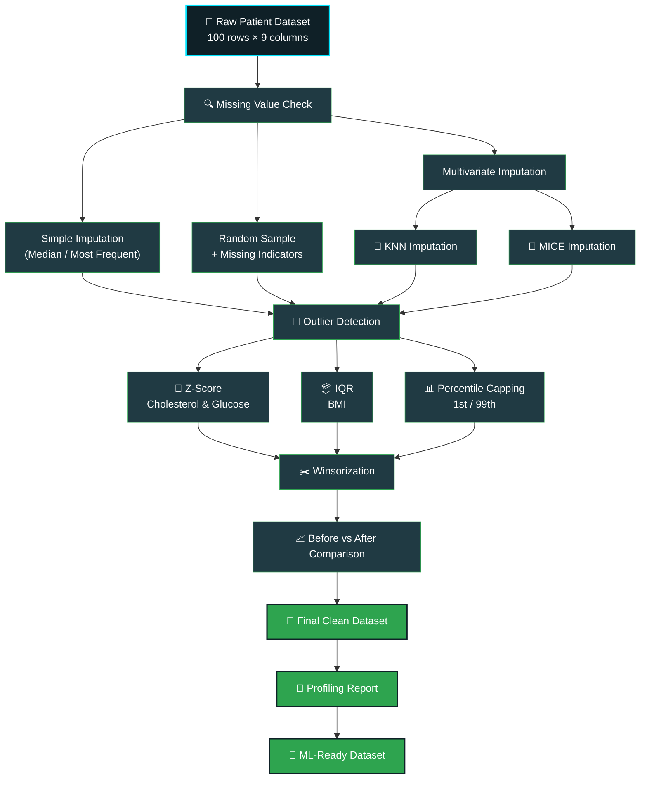
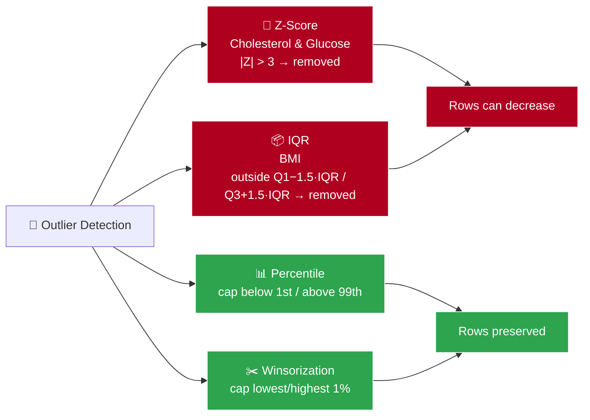
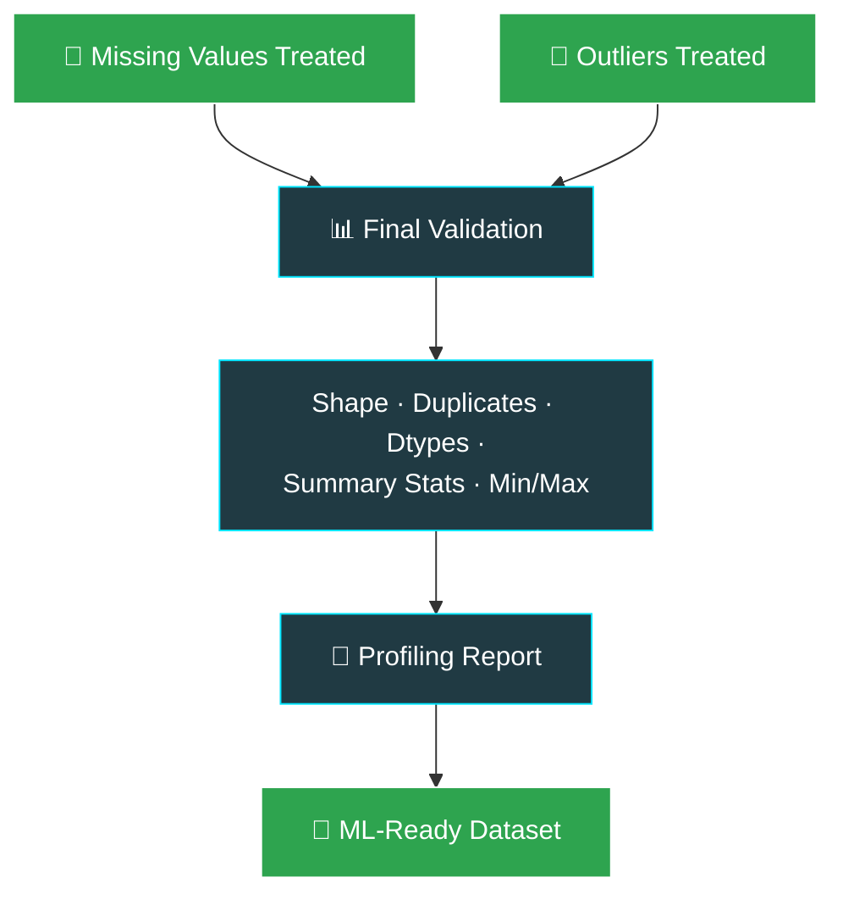

   #                                                      DATA CLEANING PROJECT
<div align="center">


<br>


<br><br>

<b>
<a href="#-project-overview">Overview</a> ·
<a href="#-project-objectives">Objectives</a> ·
<a href="#-dataset-information">Dataset</a> ·
<a href="#-complete-project-workflow">Workflow</a> ·
<a href="#-part-a--handling-missing-values">Missing Values</a> ·
<a href="#-part-b--handling-outliers">Outliers</a> ·
<a href="#-part-c--final-clean-dataset">Final Dataset</a> ·
<a href="#-about-the-author">Author</a>
</b>

</div>

<br>

## 🎥 Project Presentation

### ▶️ Watch the Complete Patient Health Records Project

I created a complete video explaining the project from
introduction to final conclusion, including data cleaning, outlier
treatment, imputation, Winsorization, and Before vs After analysis.

[🎬 **Watch the Full Project Video**](https://drive.google.com/file/d/1sQ8A022Wc93GYTlcecAEU8JI3-dWHsc-/view?usp=sharing)

## 📌 Project Overview

This project delivers a complete, end-to-end **data-cleaning and preprocessing pipeline** for a real-world-style **Patient Health Records dataset**, built to be analysis-ready and machine-learning-ready.

The workflow demonstrates how to systematically detect and treat:

| Category | What Was Handled |
|---|---|
| 🔍 Missing Values | Numerical, categorical, and multivariate missingness |
| 🚨 Extreme Values | Statistical outliers across key health metrics |
| 📈 Distribution Issues | Skew introduced by unusual BMI, cholesterol & glucose readings |
| 🧹 Data-Quality Problems | Inconsistencies affecting downstream ML models |

Everything was implemented end-to-end in **Jupyter Notebook** using **Python**, transforming a raw patient dataset into a clean, consistent, machine-learning-ready dataset.

---

## 🎯 Project Objectives

| # | Objective | Status |
|---:|---|:---:|
| 1 | Understand different missing-value patterns | ✅ |
| 2 | Apply multiple missing-value imputation strategies | ✅ |
| 3 | Create missing-value indicators | ✅ |
| 4 | Perform random-sample imputation | ✅ |
| 5 | Implement KNN imputation | ✅ |
| 6 | Implement MICE-style chained-equation imputation | ✅ |
| 7 | Detect extreme values using the Z-score method | ✅ |
| 8 | Detect unusual BMI values using the IQR method | ✅ |
| 9 | Cap values using the 1st and 99th percentiles | ✅ |
| 10 | Apply Winsorization | ✅ |
| 11 | Compare dataset shape before and after treatment | ✅ |
| 12 | Compare summary statistics before and after treatment | ✅ |
| 13 | Prepare a final cleaned dataset | ✅ |
| 14 | Generate a profiling report | ✅ |
| 15 | Prepare the dataset for machine-learning workflows | ✅ |

---

## 📂 Dataset Information

<div align="center">


</div>

| Column | Description |
|---|---|
| `patient_id` | Unique patient identifier |
| `age` | Patient age |
| `gender` | Patient gender |
| `region` | Patient region |
| `bmi` | Body Mass Index |
| `blood_pressure` | Blood pressure measurement |
| `cholesterol` | Cholesterol measurement |
| `glucose` | Glucose measurement |
| `disease_risk` | Disease-risk indicator |

**Repository layout**

```text
📦 patient-health-records-cleaning
 ┣ 📜 patient_health_records.csv              → raw input data
 ┣ 📓 data_cleaning_notebook.ipynb             → full cleaning workflow
 ┣ 📜 patient_health_records_final_clean.csv   → final ML-ready output
 ┗ 📄 README.md
```

---

## 🧭 Complete Project Workflow



---

## 🧩 Part A — Handling Missing Values

### 🔍 1. Identifying Missing Values

The dataset was inspected to determine which columns contained missing values, how many observations were affected, and what percentage of each column was missing.

Missing values were found in **Age, Gender, Region, BMI, Cholesterol,** and **Glucose**. `patient_id`, `blood_pressure`, and `disease_risk` had no missing values.

### 📊 2. Missing Value Percentage

Calculating the percentage (rather than raw counts) of missing values gave a clearer view of the scale of the problem relative to the total number of records. The missing-data percentage was small enough that **imputation was preferred over row deletion**.

### 🧮 3. Simple Imputation

| Variable Type | Column(s) | Strategy | Why |
|---|---|---|---|
| Numerical | BMI | Median imputation | Less sensitive to extreme values than the mean |
| Categorical | Gender, Region | Most-frequent category | Simple, effective for low missingness |

### 🎲 4. Missing Indicator + Random Sample Imputation

A **missing-value indicator** (`0` = originally present, `1` = originally missing) was created for every affected column, preserving the record of what was originally missing.

**Random-sample imputation** then filled gaps by drawing from the column's own observed distribution — retaining more natural variation than a single fixed value.

### 🤖 5. KNN Imputation

Applied to **Age, BMI, Blood Pressure, Cholesterol,** and **Glucose** — estimating each missing value from the most similar patient records rather than a single global statistic.

### 🧠 6. MICE — Multiple Imputation by Chained Equations

Applied across **Age, BMI, Cholesterol,** and **Glucose**, using the relationships *between* variables (rather than treating each column independently) to estimate missing values through repeated chained regressions.

### 🔎 7. Strategy Comparison

| Strategy | Data Type | Purpose |
|---|---|---|
| Median Imputation | Numerical | Replace missing BMI values |
| Most Frequent | Categorical | Replace missing Gender & Region |
| Missing Indicator | Numerical / Categorical | Flag originally-missing values |
| Random Sample Imputation | Numerical / Categorical | Preserve natural distribution |
| KNN Imputation | Numerical | Estimate via similar patient records |
| MICE | Multiple Numerical | Estimate via inter-variable relationships |

### ✅ 8. Final Verification

A final missing-value check confirmed no unintended gaps remained before proceeding to outlier treatment.

> **🎯 Key Takeaway:** Part A transformed an incomplete dataset into an analysis-ready one, matching each imputation strategy to the characteristics of its variable rather than applying a one-size-fits-all fix.

---

## 🚨 Part B — Handling Outliers



### 📏 1. Z-Score Method

Used to flag extreme **Cholesterol** and **Glucose** values, where any observation with an absolute Z-score **> 3** was treated as an outlier. Records matching this condition on either variable were **removed**, and patient IDs were verified before/after to confirm successful removal.

### 📦 2. IQR Method

Used specifically for **BMI**. Boundaries were computed as:

```
Lower Limit = Q1 − 1.5 × IQR
Upper Limit = Q3 + 1.5 × IQR
```

BMI values outside these bounds were treated as unusual and removed. *Missing BMI values were never counted as outliers* — only genuine out-of-range values were.

### 📊 3. Percentile Method

The **1st and 99th percentiles** were used as capping boundaries — values beyond them were pulled in to the boundary value, with **no rows removed**.

### ✂️ 4. Winsorization

The lowest and highest **1%** of values were capped rather than deleted, preserving every patient record while controlling the influence of extreme values.

| Method | Main Variable(s) | Treatment | Patient Records |
|---|---|---|---|
| Z-Score | Cholesterol, Glucose | Extreme records removed | Can decrease |
| IQR | BMI | Unusual records removed | Can decrease |
| Percentile | Numerical variables | Capped at 1st/99th percentile | Preserved |
| Winsorization | Numerical variables | Extreme values capped | Preserved |

### 📐 5–6. Shape & Summary-Statistics Comparison

Dataset **shape** (rows/columns) and **descriptive statistics** (count, mean, std, min, 25%, median, 75%, max) were compared before and after treatment — confirming that Z-score and IQR reduced row count, while Percentile capping and Winsorization preserved every record while normalizing the extremes.

> **🎯 Key Takeaway:** Part B applied each outlier technique for its intended purpose — removal where genuine data-quality issues existed, capping where record preservation mattered more — rather than treating every variable the same way.

---

## 🧹 Part C — Final Clean Dataset

With missing values treated (Part A) and outliers handled (Part B), the dataset moved through final validation:



### 📊 Before vs After Data Quality

| Data Quality Area | Before Cleaning | After Cleaning |
|---|:---:|:---:|
| Missing values | Present | ✅ Treated |
| Extreme values | Present | ✅ Handled |
| Unusual BMI values | Present | ✅ Treated |
| Dataset consistency | Needed work | ✅ Improved |
| Analysis readiness | Limited | ✅ Improved |
| ML readiness | Needed preprocessing | ✅ Prepared |

### 📈 Profiling & ML Readiness

A full **profiling report** was generated covering dataset structure, variable types, missing values, statistical distributions, correlations, and duplicate detection — giving a complete quality overview of the final dataset.

The cleaned dataset is now a solid foundation for:

**Exploratory Data Analysis → Feature Engineering → Data Visualization → Model Building → Model Evaluation**

*(Additional preprocessing may still be needed depending on the specific ML algorithm used.)*

### 💾 Final Output

```
patient_health_records_final_clean.csv
```

---

## 🏆 Results at a Glance

<div align="center">

| Area | Status |
|:---|:---:|
| 🔍 Data Inspection | ✅ |
| 🧩 Missing Value Analysis | ✅ |
| 🎲 Random Sample Imputation | ✅ |
| 🤖 KNN Imputation | ✅ |
| 🧠 MICE Imputation | ✅ |
| 📏 Z-Score Detection | ✅ |
| 📦 IQR Detection | ✅ |
| 📊 Percentile Capping | ✅ |
| ✂️ Winsorization | ✅ |
| 🔄 Before vs After Comparison | ✅ |
| 🧹 Final Clean Dataset | ✅ |
| 📈 Profiling Report | ✅ |
| 🤖 ML Preparation | ✅ |

</div>

> **🧠 Key Learning:** Data cleaning is not about deleting problematic values — it's about understanding the data, choosing the right treatment for each variable, and validating the result. Different problems require different solutions.

---

## 🛠️ Tech Stack

<div align="center">


<br><br>


</div>

---

## 👨‍💻 About the Author

<div align="center">


<br>


</div>

**Roshan Marathe** is an AI/ML Engineer working at the intersection of **data analytics, machine learning, and quantitative systems** — with a practical focus on building clean, reliable pipelines that real models can be trained on.

This project reflects that approach in practice: identifying missing-data patterns, matching each variable to the *right* imputation and outlier-treatment strategy, and validating results rather than assuming cleaning automatically improves data.

**Core focus areas:** Python for Data Analysis · Statistical Thinking · Data Cleaning & Preprocessing · Machine Learning · Quant Systems · Exploratory Data Analysis · Power BI & Dashboards

<div align="center">

<a href="https://github.com/">

</a>

<br><br>


</div>
